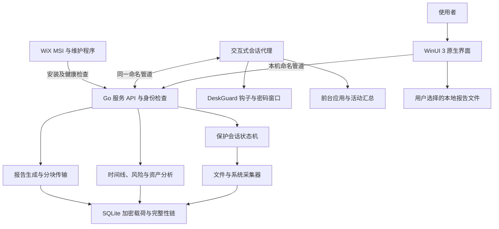
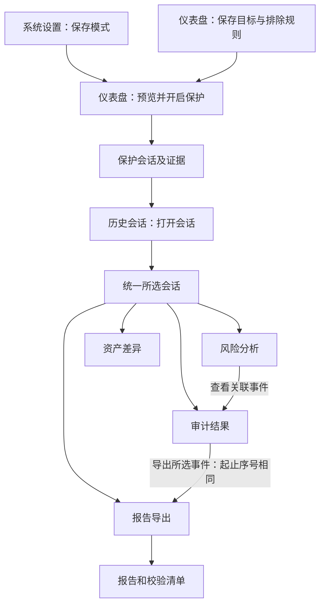
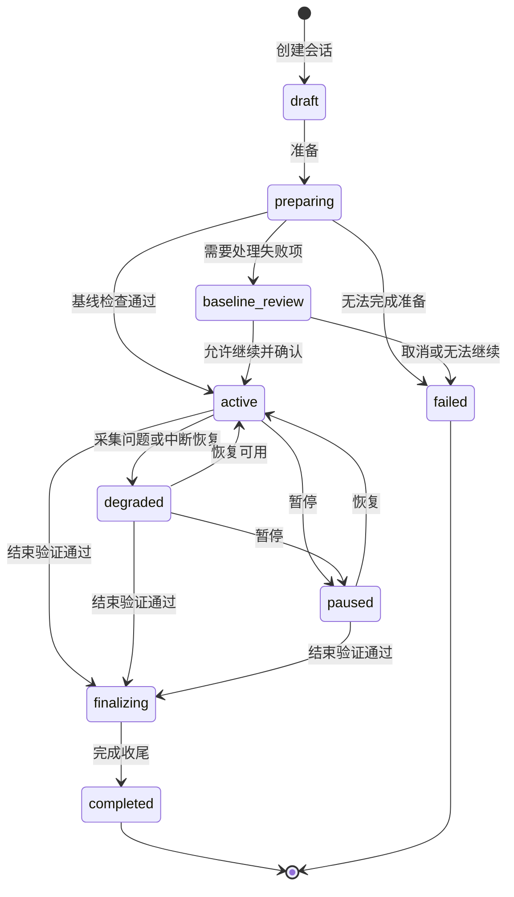
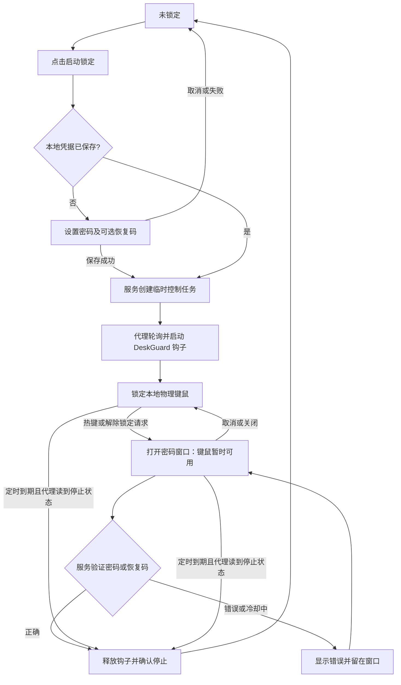
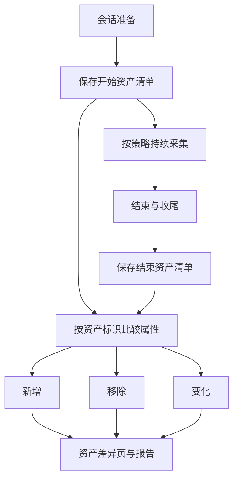
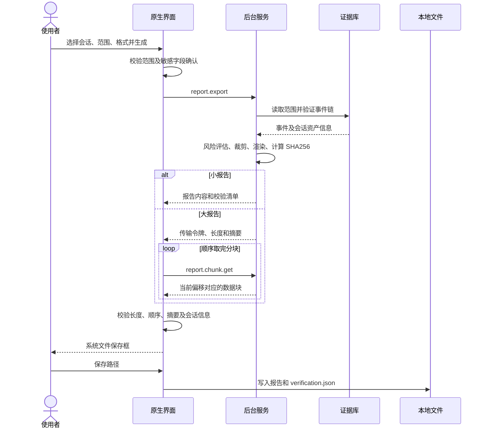
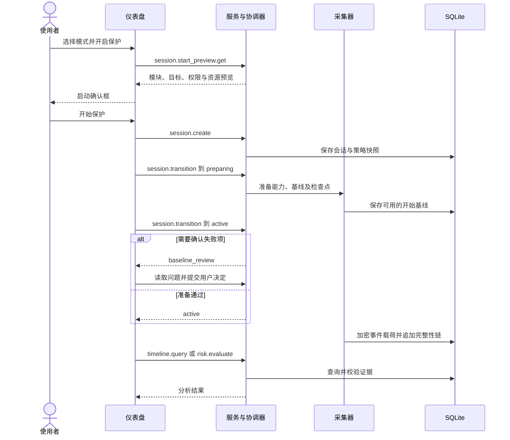
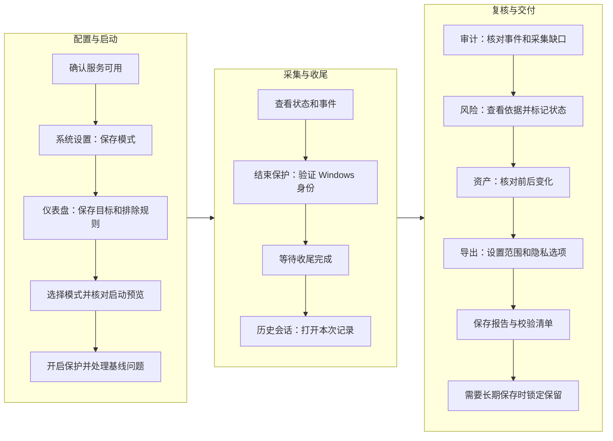
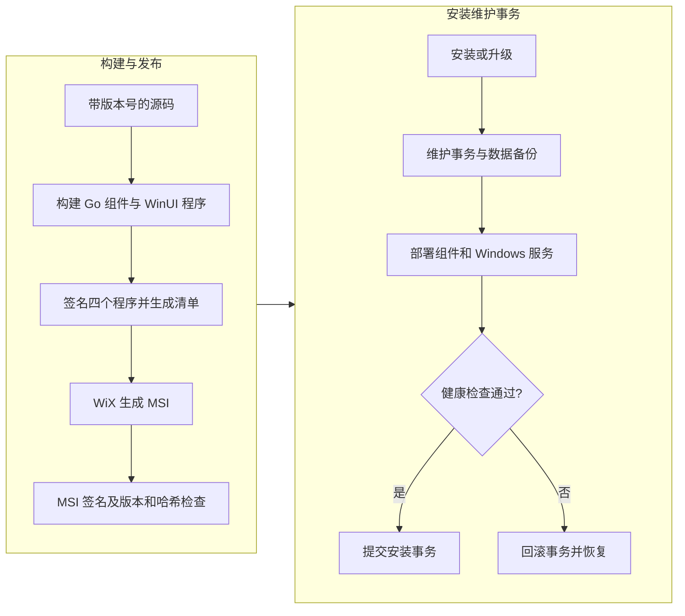

# Desktop Guard Pro 技术架构与完整操作说明

本文面向使用者、开发者和交付验收人员，说明软件的设计意图、运行架构、七个导航页、
可见按钮及配置项的技术行为，并用流程图串联保护、分析、导出和临时键鼠锁定。

核对基准：`v2.11.40`，包含 MSI 指定证书迁移。
核对日期：2026 年 9 月 30 日。本文依据当前 Windows 原生界面的实际实现；
测试覆盖和待验收事项以[需求验收矩阵](requirements-acceptance-matrix.md)为准。
图使用 Mermaid 编写，可在支持 Mermaid 的 Markdown 阅读器中直接显示。

## 1. 设计意图与使用边界

软件围绕一次有明确起止时间的“保护会话”组织证据：记录期间发生的变化，
保留事件来源和完整性信息，帮助你在返回电脑后查明发生过什么，再形成可交付报告。
另有独立的临时键鼠锁定，用于暂时停用本地物理输入。

### 1.1 要解决的问题

各项能力分别回答不同的问题，共同组成一条审计工作链。

| 使用问题 | 软件提供的能力 | 结果入口 |
| --- | --- | --- |
| 离开电脑期间，指定文件或目录发生了什么变化？ | 文件通知、哈希、重扫、条件满足时的 USN 补偿和严格读取审计 | 审计结果 |
| 软件、设备、账户或系统配置是否变化？ | 周期观察和会话开始、结束时的资产清单比较 | 审计结果、资产差异 |
| 哪些变化需要人工确认？ | 根据已采集证据执行风险规则，展示依据和处置状态 | 风险分析 |
| 如何回看上一次检查并保留证据？ | 按会话查询、保留锁、分范围报告和校验清单 | 历史会话、报告导出 |
| 如何暂时避免本地键盘鼠标干扰操作？ | 复用 DeskGuard 钩子和解锁窗口，支持定时或密码验证解除 | 仪表盘的临时锁定键鼠 |

“电脑保护”的主要交付是记录、发现和解释变化。风险处置按钮只更新审阅状态，
不会删除文件、杀死进程、回滚配置或自动修复系统。采集受模块开关、权限、采样周期、
设备状态和 Windows 提供的数据影响，空列表需要结合覆盖信息解释。

### 1.2 两条独立工作线

保护会话和临时锁定可以单独运行，也可以同时使用，结束其中一条不会代替另一条的结束操作。

| 对比项 | 电脑保护 | 临时锁定键鼠 |
| --- | --- | --- |
| 核心对象 | 持久化的 `Session.ID` | 临时任务 `ControlID` |
| 目的 | 采集、分析、留存、导出 | 阻断本地物理键鼠输入 |
| 启动位置 | 仪表盘 **开启保护** | 仪表盘 **启动锁定** |
| 结束验证 | Windows 账户凭据和服务端结束挑战 | 本软件保存的本地密码或一次性恢复码 |
| 持久化 | 会话、事件、基线等进入 SQLite | 凭据持久化，临时任务本身保存在服务内存 |
| 服务重启 | 识别未完成会话，按恢复逻辑处理并保留中断边界 | 不恢复临时任务；代理重新连上服务后按新状态释放 |
| 分析关联 | 历史、审计、风险、资产、报告都通过会话 ID 关联 | 当前临时控制上报不进入保护会话时间线 |

## 2. 总体技术架构

软件采用本机多进程架构。原生界面负责交互，后台服务负责授权、任务、采集和数据，
交互式代理负责用户桌面上的输入与窗口行为，维护程序负责安装生命周期。

### 2.1 四个运行程序

四个程序有不同的权限和生命周期，关闭主窗口只结束界面进程。

| 程序 | 技术与运行位置 | 主要职责 | 主要源码 |
| --- | --- | --- | --- |
| `desktop-guard-ui.exe` | C#、.NET 8、WinUI 3，用户桌面 | 七页界面、输入检查、会话选择、IPC、系统文件保存框 | [原生界面工程](../frontend/DesktopGuardPro.Native/) |
| `desktop-guard-service.exe` | Go、Windows Service | 所有者授权、状态机、采集、存储、分析、报告、保留策略 | [服务入口](../backend/cmd/desktop-guard-service/)、[服务核心](../backend/internal/service/) |
| `desktop-guard-agent.exe` | Go，当前交互式 Windows 会话 | 用户活动、输入设备、DeskGuard 钩子、密码窗口 | [代理入口](../backend/cmd/desktop-guard-agent/)、[代理核心](../backend/internal/agent/) |
| `desktop-guard-maintenance.exe` | Go，安装维护时使用相应权限 | 安装、升级、卸载、备份、事务恢复、签名与健康检查 | [维护入口](../backend/cmd/desktop-guard-maintenance/)、[维护核心](../backend/internal/maintenance/) |

服务处在 Windows 服务会话中，输入钩子和密码窗口需要运行在用户桌面。
原生界面启动时会检查当前会话代理，必要时从安装目录启动带 `--ui-launch` 参数的代理。
代理通过会话级单实例约束避免重复运行。

### 2.2 技术选型和目录职责

当前 MSI 的主界面来自原生工程。工作区的 `frontend/` 只保留 WinUI 3 原生界面，
Go 源码集中在 `backend/`，目录和指针修复已纳入 2.11.39 MSI。

| 技术或目录 | 在当前交付中的用途 |
| --- | --- |
| .NET 8、Windows App SDK `1.8.260508005` | 原生控件、窗口、导航、弹窗、文件选择器，自包含发布 |
| Go，`backend/go.mod` 指定工具链 `1.26.6` | 服务、代理、维护程序及领域逻辑 |
| SQLite / `modernc.org/sqlite` | 本机结构化持久化，不需要单独部署数据库 |
| `go-winio`、Win32 API | 命名管道、客户端身份、Windows 服务和系统能力 |
| `backend/internal/deskguard/` | 直接复用的 DeskGuard 钩子、解锁状态机、Walk 对话框和输入法处理 |
| `backend/internal/domain/` | 会话状态、监控模式、输入控制策略等领域对象 |
| `backend/internal/collector/` | 文件、进程、注册表、设备、系统与网络采集 |
| `backend/internal/storage/` | 数据库、迁移、加密记录、分页查询和保留清理 |
| `backend/internal/risk/`、`backend/internal/reporting/` | 风险规则、证据模型、报告与敏感字段裁剪 |
| `backend/internal/contracts/`、`backend/internal/windows/` | IPC 协议及 Windows 平台实现 |
| `installer/`、`scripts/` | WiX 定义、构建、签名、发布检查 |
| `frontend/` | WinUI 3 原生界面和状态回归测试 |

最低声明平台为 Windows 10 1809 x64。原生工程使用 Windows 10 SDK 26100 目标，
窗口采用 Per-Monitor V2 DPI 感知；主界面不依赖 WebView2 Runtime。

## 3. 页面如何共享状态和数据

理解“运行中的任务”和“正在查看的数据”是使用七个页面的关键。
打开历史记录只改变分析对象，后台正在运行的保护会话继续按照原策略采集。

### 3.1 必须区分的对象

界面与后台使用以下对象建立关联，名称相似的对象具有不同作用域。

| 对象 | 作用域与含义 | 改变它的主要入口 |
| --- | --- | --- |
| 当前保护会话 | 服务协调器管理的保护任务及状态 | 仪表盘开启、暂停、恢复、结束 |
| 所选分析会话 | `AnalysisWorkspace.Session`，供审计、风险、资产、报告共用 | 历史行 **打开会话**、**当前 / 最近会话** |
| 会话策略快照 | 创建会话时保存的监控模式和具体策略 | 新建保护时确定，后续设置不追溯修改 |
| 正在编辑的模式 | 设置页面中的宽松、标准、严格或自定义草稿 | **正在配置的模式** 下拉框 |
| 仪表盘本次模式 | 本次准备启动保护时选用的模式 | 仪表盘 **保护模式** 下拉框 |
| 临时控制任务 | 所有者 SID、Windows 会话 ID、控制 ID、期限和运行状态 | **启动锁定**、密码验证、到期 |
| Windows 会话 ID | 系统登录会话，用于路由交互式代理和授权 | Windows 登录过程 |

`AnalysisWorkspace.Revision` 在切换分析会话时递增，配合各页面的请求序号，
防止早发晚到的异步响应把新会话内容覆盖。即使按 A→B→A 切换，同名会话 ID 的旧请求也会失效。

### 3.2 七个导航页的输入和输出

导航页围绕同一份会话证据提供不同视角，设置页和仪表盘提供采集前的配置入口。

| 导航页 | 输入 | 主要输出 | 与其他页面的关系 |
| --- | --- | --- | --- |
| 仪表盘 | 监控范围、模式、本次名称、临时控制参数 | 保护会话或独立锁定任务 | 创建分析数据；提供历史、审计和导出快捷入口 |
| 历史会话 | 已保存会话及分页游标 | 所选会话、保留锁 | 为四个分析页面选择共同对象 |
| 审计结果 | 所选会话、筛选条件、游标 | 事件列表、证据详情、单事件导出范围 | 承接风险证据跳转，向报告页传递序号 |
| 风险分析 | 所选会话的证据与策略快照 | 风险项、证据链接、人工处置状态 | 证据定位到审计页；报告可包含分析结果 |
| 资产差异 | 所选会话的开始和结束资产清单 | 新增、移除、变化及属性详情 | 帮助解释整体变化；报告包含会话资产结果 |
| 报告导出 | 所选会话、序号范围、格式、敏感字段选项 | 报告文件与 `.verification.json` | 汇总证据，完成对外交付 |
| 系统设置 | 四种模式及五类模块策略 | 保存后的模式配置 | 新保护使用配置快照；临时控制使用已保存的自定义输入规则 |

### 3.3 四个分析页的公共会话栏

审计、风险、资产、报告页使用同一组件。实现集中在
[App.Analysis.cs](../frontend/DesktopGuardPro.Native/App.Analysis.cs) 和
[AnalysisWorkspace.cs](../frontend/DesktopGuardPro.Native/AnalysisWorkspace.cs)。

| 按钮或控件 | 具体行为 | 技术与生效范围 |
| --- | --- | --- |
| 会话名称和状态 | 显示当前分析对象，提示中可见会话 ID | 只读，不代表此会话正在运行 |
| **选择历史会话** | 打开历史页，等待选择某一行 | 页面导航，不停止任何保护 |
| **当前 / 最近会话** | 优先取 `health.get` 返回的会话，否则取 `session.list` 的最近记录 | 更新共同选择并加载当前分析页 |
| **审计** | 保持所选会话进入审计结果 | `timeline.query` |
| **风险** | 保持所选会话进入风险分析 | `risk.evaluate` |
| **资产** | 保持所选会话进入资产差异 | `asset_difference.query` |
| **导出** | 保持所选会话进入报告表单 | 进入页面不生成文件 |

选择不同会话后，界面清理旧事件、风险、资产、事件详情、分页游标、待定位证据及报告序号范围，
避免上一会话的条件被误用。没有主动选择时，页面尝试使用当前或最近会话。
仪表盘的审计和导出快捷入口会优先选择服务当前会话。

## 4. 主窗口、菜单与全局操作

主窗口使用深蓝导航、浅色内容区和统一功能卡片。仪表盘通过两个主任务卡区分电脑保护和键鼠锁定，
其他页面使用会话栏、工具栏、列表和详情区保持一致。

### 4.1 标题栏和刷新机制

顶部状态定时刷新与分析数据查询分开运行，避免把状态轮询理解为实时重载所有列表。

| 控件或行为 | 实际效果 |
| --- | --- |
| 导航展开按钮 | 切换 `NavigationView.IsPaneOpen`；不发送 IPC |
| 七个导航项 | 切换页面；历史、审计、风险、资产进入时查询，报告准备所选会话，设置读取配置 |
| 服务状态标记 | 显示连接、运行、降级或不可用等状态，只读 |
| 保护状态标记 | 显示服务返回的保护状态，只读 |
| 最小化、最大化、关闭 | 使用 Windows 窗口行为；关闭不会调用结束保护或解除锁定接口 |
| 定时刷新 | 主界面约每 5 秒执行健康查询并刷新临时控制状态，带忙碌保护 |
| 系统托盘图标 | 当前实现提供图标与提示文字；没有托盘菜单或双击恢复逻辑 |

关闭窗口会停止界面计时器并释放托盘图标，后台服务和独立代理按各自生命周期运行。
需要结束采集或解除锁定时，先完成对应操作并核实结果。

### 4.2 顶部菜单的每个入口

菜单是现有页面和局部区域的快捷入口，较窄窗口中的紧凑菜单复用这些动作。

| 菜单 | 项目与快捷键 | 处理动作 |
| --- | --- | --- |
| 文件 | **历史会话**，Ctrl+H | 打开历史页 |
| 文件 | **报告导出**，Ctrl+E | 打开报告页 |
| 文件 | **退出** | `mainWindow.Close()` |
| 编辑 | **重点对象与递归设置**，Ctrl+D | 打开仪表盘，展开监控范围并聚焦目标输入框 |
| 编辑 | **排除规则设置** | 打开仪表盘，展开范围并聚焦排除输入框 |
| 编辑 | **系统设置** | 打开设置页 |
| 查看 | **仪表盘**，Ctrl+1 | 打开仪表盘 |
| 查看 | **历史会话**，Ctrl+2 | 打开历史页并读取列表 |
| 查看 | **事件时间线**，Ctrl+3 | 打开导航中名为“审计结果”的页面 |
| 查看 | **风险分析**，Ctrl+4 | 打开风险页并评估 |
| 查看 | **资产差异**，Ctrl+5 | 打开资产页并查询 |
| 查看 | **报告导出**，Ctrl+6 | 打开报告页 |
| 查看 | **系统设置**，Ctrl+7 | 打开设置页并读取配置 |
| 查看 | **刷新当前页面**，F5 | 历史重新读首页、审计重新查询、风险重新评估、资产重新查询；其余页面执行健康刷新 |
| 查看 | **展开或收起导航栏**，Ctrl+B | 切换导航展开状态 |
| 设置 | **系统设置** | 打开设置页 |
| 设置 | **会话保留设置** | 打开历史页，通过各行保留按钮管理 |
| 设置 | **敏感字段与报告设置** | 打开报告页 |
| 设置 | **关于 Desktop Guard Pro** | 显示说明弹窗，**关闭** 只关闭该弹窗 |

F5 在设置页不会保存或重置模式，在报告页不会生成报告。
菜单实现位于 [App.xaml.cs](../frontend/DesktopGuardPro.Native/App.xaml.cs) 的 `CreateMenuBar`。

## 5. 仪表盘：创建和控制保护会话

仪表盘把高频动作放在主卡片，把名称、采集详情、目标和服务信息放在可展开区域。
保护主按钮根据服务状态改变文字，所有状态由后台结果驱动。

### 5.1 电脑保护卡片

以下控件决定本次任务的输入，以及从准备到结束的过程。

| 控件或按钮 | 使用目的 | 处理函数、接口与效果 |
| --- | --- | --- |
| **保护模式** 下拉框 | 选择宽松、标准、严格、自定义 | `LoadSessionStartPreviewAsync` → `session.start_preview.get`，只预览本次模块和权限 |
| **管理监控目标 · N 个** | 查看或维护文件监控范围 | `RevealDashboardScope` 展开范围并滚动到该区域 |
| **启动选项与采集详情** | 展开会话名称和策略摘要 | 本地展开控件，不写数据 |
| **会话名称** | 给本次保护命名 | 创建时读取；留空时使用“离席保护 + 时间”自动名称 |
| **查看模式配置** | 打开系统设置 | 只导航；设置页有独立的“正在配置的模式”，需核对其选项 |
| 动态保护主按钮 | 开始、处理准备问题、结束或完成收尾 | `PerformProtectionActionAsync`，详见状态表 |
| **暂停保护** | 暂停正在活动或降级的会话 | `ToggleProtectionPauseAsync` → `session.transition`，目标 `paused` |
| **恢复保护** | 继续暂停的会话 | 同一处理函数，目标 `active` |

暂停和恢复直接请求状态转换，不使用临时控制的本地密码。
运行中的会话继续使用创建时的策略快照，修改模式下拉框不会替换这份快照。

### 5.2 主按钮、确认框与状态转换

一次按钮点击可能包含多次服务请求。界面会先查询服务状态，并通过忙碌标记抑制重复提交。

| 服务状态 | 主按钮文字 | 点击后的技术流程 |
| --- | --- | --- |
| 无会话 | **开启保护** | 获取预览，确认后 `session.create`，进入准备与启动流程 |
| `draft`、`preparing` | **继续启动** | 补做 `session.transition`，推进准备、基线检查和启动 |
| `baseline_review` | **处理失败项** | `session.baseline_review.get`，打开失败项处理框 |
| `active`、`degraded`、`paused` | **结束保护** | `session.end_verification.create` → Windows 凭据窗口 → 验证后转 `finalizing` |
| `finalizing` | **完成收尾** | 请求转 `completed`，等待结束扫描、基线和相关收尾处理 |
| `completed`、`failed` | **开启新保护** | 创建新的会话 ID，保留旧记录 |

| 弹窗按钮 | 条件和效果 |
| --- | --- |
| 启动确认框 **开始保护** | 接受预览，继续创建和启动 |
| 启动确认框 **取消** | 关闭弹窗，不创建本次保护 |
| 基线问题框 **继续保护** | 服务允许继续时提交 `session.baseline_review.resolve`；失败项仍有记录 |
| 基线问题框 **继续不可用** | 服务不允许继续时禁用 |
| 基线问题框 **取消保护** | 服务允许取消时提交取消决定 |
| 基线问题框 **关闭** | 仅关闭查看窗口，保留等待处理状态 |
| Windows 身份验证窗口的确认和取消 | 确认后提交挑战令牌及 Windows 凭据；取消则保持会话原状态 |

保护状态机定义见 [session.go](../backend/internal/domain/session.go)，调度见
[coordinator.go](../backend/internal/service/coordinator.go)。图中的恢复指服务识别到中断后的处理，
正常运行期间的状态转换仍由服务校验。

### 5.3 监控范围与排除规则

展开 **监控范围与排除规则** 后维护文件活动采集范围。
这些行是配置草稿，删除一行不会删除磁盘上的文件或目录。

| 控件或按钮 | 用途 | 技术行为与限制 |
| --- | --- | --- |
| 目标路径输入框 | 输入目录、单文件或可移动卷路径 | 手动文本输入，当前没有路径浏览按钮；保存时去空白、去重并由后台校验 |
| 目标类型下拉框 | 选择目录、文件、可移动卷 | 对应 `directory`、`file`、`removable_volume`，决定采集器构造方式 |
| **监控子目录** 开关 | 控制目录递归 | 目录目标可用；单文件无递归语义，可移动卷采集按其实现递归 |
| 目标行 **删除** | 移除该行配置草稿 | 最后一行移除后保留空白输入行；点击保存后才写入 |
| **新增目录** | 增加一行目标输入 | 本地新增，类型仍可改成文件或可移动卷 |
| **重新读取目录** | 用服务端配置重载界面 | `LoadDirectoriesAsync` → `directory_monitoring.get`；同时读取排除规则和模式，未保存的目标及排除行会被替换 |
| **保存目录** | 持久化当前非空目标 | `SaveDirectoriesAsync` → `directory_monitoring.update {targets}`；返回规范化路径后刷新启动预览 |
| 排除内容输入框 | 输入排除匹配值 | 随类型解释为路径、文件名、扩展名或进程 |
| 排除类型下拉框 | 选择匹配维度 | `path`、`file_name`、`extension`、`process` |
| 排除行 **删除** | 移除该行草稿 | 需要保存规则才生效 |
| **新增规则** | 增加一行排除配置 | 只修改本地表单 |
| **保存规则** | 持久化非空、去重后的规则 | `directory_monitoring.update {exclusions}` |

服务禁止在已经开始准备、活动、暂停、降级或收尾的会话中更改监控范围。
可以在任务结束后保存范围，再启动新会话。排除规则用于对应的文件采集链路，
不能据此认为软件、设备和系统模块也会排除相同对象。

### 5.4 记录入口和服务信息

仪表盘下方提供结果快捷入口，并把低频运行信息放在展开区域。

| 按钮或展开区域 | 作用与调用 |
| --- | --- |
| **历史记录** | 打开历史页并查询会话列表 |
| **审计结果** | 优先选择健康查询中的当前会话，进入时间线 |
| **导出报告** | 优先选择当前会话，进入报告表单 |
| **服务详情** | 展开服务状态说明 |
| **刷新服务状态** | 调用健康刷新，并读取临时控制；不执行 Windows 服务启动或安装 |

## 6. 仪表盘：临时锁定键鼠与解锁

临时控制复用 DeskGuard 的物理输入判断、注入输入放行、解锁触发和密码窗口逻辑，
通过适配层连接本项目已有的凭据存储、任务期限、设备与状态上报。
复用代码见 [DeskGuard 目录](../backend/internal/deskguard/)，运行协调见
[input_shield_runtime_windows.go](../backend/internal/agent/input_shield_runtime_windows.go)。

### 6.1 主卡片的每个操作

当前界面统一控制键盘和鼠标，包括物理鼠标移动；旧截图中的键盘、鼠标独立允许开关已退出当前操作流程。

| 控件或按钮 | 用途 | 技术行为与条件 |
| --- | --- | --- |
| **结束方式** | 选择“到时自动释放”或“持续到验证解锁” | 分别构造定时任务或 `indefinite=true`；切换只修改表单 |
| **持续时间（分钟）** | 设置定时长度 | 1–480，默认 15；持续到验证解锁时禁用，发送时长 0 |
| **启动锁定** | 创建独立临时任务 | `StartTemporaryInputControlAsync` 检查凭据，再调用 `input_control.start` |
| **解除锁定** | 请求打开验证窗口 | `StopTemporaryInputControlAsync` → `input_control.stop {verify:true}`，先设置解锁请求，不直接绕过密码 |
| **高级设置与设备** | 展开规则、运行状态和本地凭据操作 | 本地浮层，包含下表五个按钮 |
| 状态说明 | 区分未锁定、启动中、运行、验证、异常和等待停止确认 | `input_control.get`；服务接受任务不代表钩子已经运行 |

临时规则来自已保存的自定义模式 `InputShield`，并经 `ForTemporaryControl()` 固定为：
同时阻断本地键鼠、兼容注入输入、使用本地凭据、允许恢复码、不在重启后恢复任务。
它不使用仪表盘上为审计选定的宽松、标准或严格模式。

### 6.2 高级设置、设备和凭据按钮

设置和设备清单可以在未启动锁定时使用。原生界面通过服务通信，密码验证本身由交互式代理打开窗口执行。

| 按钮 | 处理函数与接口 | 实际结果 |
| --- | --- | --- |
| **控制规则设置** | `ShowInputShieldPolicyDetailsAsync` | 编辑自定义模式的输入规则；保存时调用 `directory_monitoring.update` |
| **刷新状态** | `LoadInputShieldManagementAsync` → `input_shield.status.get`、`input_shield.credential.get` | 显示钩子状态、最近心跳、设备数、丢弃事件及凭据是否配置 |
| **查看输入设备** | `ShowInputShieldDevicesAsync`，先刷新设备状态 | 对话框展示键鼠标识和活跃信息，**关闭** 返回；没有逐设备封禁按钮 |
| **设置本地密码** | `ConfigureInputShieldCredentialsAsync` → `input_shield.credential.update` | 保存独立本地密码，可同时生成一次性恢复码 |
| **删除本地密码** | `DeleteInputShieldCredentialsAsync` → `input_shield.credential.delete` | 删除密码及恢复码；依赖该凭据的任务运行或等待停止确认时，服务拒绝删除 |

| 凭据弹窗中的控件或按钮 | 行为 |
| --- | --- |
| 密码、确认密码输入框 | 两次输入需一致；服务接受 8–128 个有效 UTF-8 字符 |
| **生成一次性恢复码** | 默认开启；保存凭据时生成新的恢复码 |
| **保存凭据** | 提交保存请求；失败显示原因，不假定保存成功 |
| **取消** | 放弃本次输入 |
| 恢复码文本 | 可选择复制；该窗口关闭后无法再次查看明文 |
| **我已保存** | 关闭恢复码窗口，不等于程序已替你保存备份 |
| 删除确认框 **删除** | 执行凭据删除 |
| 删除确认框 **取消** | 保留原凭据 |
| 操作结果框 **关闭** | 关闭成功或失败提示 |

### 6.3 控制规则中每个配置项

这些选项通过 **保存配置** 一次提交，**取消** 放弃本次对话框修改。
已运行任务以启动时策略为准；保存规则不会热替换相同控制 ID 的钩子配置。

| 配置项 | 范围或依赖 | 对应技术行为 |
| --- | --- | --- |
| 显示多显示器输入阻断告警 | 开关 | 决定是否创建告警覆盖窗口 |
| 告警显示时间 | 1–60 秒；告警开启时可编辑 | 控制被阻断输入触发的告警时长 |
| 告警提示内容 | 最多 120 字符；空白回退默认提示 | 覆盖窗口文字 |
| 识别当前活跃键盘与鼠标 | 开关 | 将设备跟踪信息带入控制状态；独立设备清单仍由代理维护 |
| 新键鼠设备接入时告警并记录 | 依赖设备识别 | 接入上报；显示告警还依赖告警窗口可用 |
| 记录键鼠设备移除 | 依赖设备识别 | 控制移除上报 |
| 本地解锁触发方式 | 组合键 / 单键连续点击 | 选择 DeskGuard 热键或连击检测 |
| 解锁键 Windows 虚拟键码 | 1–255，空格 32，U 为 85 | 设置主键；当前默认主键为空格 |
| 组合键包含 Ctrl / Alt / Shift | 三个独立开关；组合键方式可编辑 | 默认 Ctrl+Alt+Space；三个修饰键都关闭时保存逻辑补上 Ctrl |
| 连续点击次数 | 3–12；连击方式可编辑 | 达到次数后请求密码窗口 |
| 连续点击时间窗口 | 500–10000 毫秒；连击方式可编辑 | 限定连击统计窗口 |
| 连续失败锁定阈值 | 1–10，默认 5 | 服务端累计验证失败并限制再次验证 |
| 失败锁定时间 | 10–3600 秒，默认 60 | 失败阈值触发后的验证冷却时间 |
| 记录被阻断输入的类别和次数 | 开关 | 控制阻断事件上报 |
| 记录具体按键名称 | 依赖类别记录 | 对应具体键值细节策略；当前临时上报的持久化边界见下文 |
| 记录鼠标点击坐标 | 依赖类别记录 | 开启后可在阻断上报中携带坐标 |
| 钩子健康心跳 | 1–30 秒，默认 5 | 控制运行心跳上报间隔 |

当前临时控制的上报用于运行状态，并未写入保护会话的加密事件链。
因此，上述记录选项不能作为“可在审计结果或报告中查看临时按键明细”的交付承诺。
规则窗口中关于“只写入加密审计链”的说明与这条临时任务路径存在差异。

心跳报告也有边界：当前适配层 `Healthy()` 读取内部运行标志，
不能仅凭这个标志认定 Windows 钩子始终有效或所有输入都已拦截。

### 6.4 密码窗口与状态流程

默认按 **Ctrl+Alt+Space**，或通过可用的注入输入点击 **解除锁定**，请求密码窗口。
修改过触发规则时，以界面显示的已保存规则为准。

| 密码窗口操作 | 技术效果 |
| --- | --- |
| 单个密码输入框 | 接受原有本地密码或恢复码；验证层先尝试密码，再尝试允许使用的恢复码 |
| **解锁** | `input_shield.credential.verify`；成功后 DeskGuard `Unprotect()`，服务结束临时任务 |
| 错误提示 **确定** | 返回密码窗口重试；窗口仍处在验证阶段 |
| **取消** 或关闭窗口 | 返回失败结果，DeskGuard `Protect()` 恢复阻断 |
| 到期或任务被停止 | 取消窗口上下文并关闭旧窗口；旧窗口结果不能改变后来的任务 |

密码窗口打开期间，DeskGuard 进入验证状态并放行物理输入，放行范围覆盖用户桌面，
没有旧版“20 秒窗口”限制。该窗口不是 Windows 安全桌面，无法承担 Windows 锁屏的隔离能力。
Ctrl+Alt+Delete 和 Windows 安全桌面行为由操作系统控制。

代理约每 1 秒读取任务，每 5 秒上报独立设备清单，控制心跳按策略间隔发送。
服务不可连接时，代理保留已有控制状态；到期释放需要代理读取到服务端停止状态，
不能按本地精确秒表保证。密码验证也依赖服务可用。

注入输入按 DeskGuard 的输入标志兼容放行。程序无法据此识别输入是否来自某一个特定远程软件。
这里的“允许远程输入”需要在目标远程工具上实测。

### 6.5 凭据保存和兼容

DeskGuard 的界面与钩子接入本项目原有凭据管理器，已保存密码不要求转换为另一份明文配置。

密码使用 PBKDF2-HMAC-SHA256，默认 600000 次迭代、16 字节随机盐和 32 字节摘要；
校验记录再加密存储。恢复码包含 20 个随机字符，显示时分组，验证时规范化大小写与分隔符，
成功使用一次后失效。实现见
[input_shield_credentials.go](../backend/internal/service/input_shield_credentials.go)。

保护会话结束使用的 Windows 凭据与这里的本地密码分别验证。
修改本地密码不会修改 Windows 登录密码。

## 7. 历史会话：定位检查对象与保留证据

历史页读取已保存的会话，包括完成、失败和仍在进行中的记录。
每一行是一个独立审计对象，打开一行后四个分析页共同使用该会话。

| 按钮 | 处理函数或接口 | 生效结果 |
| --- | --- | --- |
| **刷新列表** | `LoadHistoryAsync(false)` → `session.list` | 清理旧分页并重读首页 |
| **加载更早会话** | `LoadHistoryAsync(true)`，传回游标 | 追加后续记录；没有更多记录时不可用 |
| 每行 **打开会话** | `SelectAnalysisSession` → 导航审计页 | 切换分析对象，不恢复旧会话采集 |
| 每行 **锁定保留** | `session.retention_lock.update {sessionId, locked:true}` | 为已完成或失败会话写入保留锁，然后重载列表 |
| 每行 **解除保留锁** | 同一接口，`locked:false` | 允许后台保留策略在满足条件时清理该会话 |

当前页没有手动删除会话、批量删除或保留天数输入框。
自动保留策略以会话 `updated_utc` 为依据：超过 90 天、状态为 `completed` 或 `failed`、
且没有保留锁的会话进入清理范围。调度在启动时检查，之后约每 24 小时运行，每批最多 100 个。
解除保留锁不会立即删除数据。

实现见 [session_history.go](../backend/internal/service/session_history.go)、
[retention.go](../backend/internal/storage/retention.go) 和
[服务运行时](../backend/cmd/desktop-guard-service/runtime.go)。

## 8. 审计结果：筛选、核对和定位证据

审计页展示所选会话中已经入库的事件，左侧列表与右侧详情联动。
菜单中的“事件时间线”与导航中的“审计结果”指向同一页面。

### 8.1 筛选字段与按钮

筛选在服务端执行，改变字段后点击应用；时间会转换为 UTC 查询。

| 控件或按钮 | 规则和技术行为 |
| --- | --- |
| **筛选事件** 展开区域 | 只控制表单显示 |
| **类别** | 全部、文件、进程、软件、系统、设备、健康；对应事件 category |
| **风险级别** | 全部、高、中、低；这里是事件级别，不等于风险页的处置状态 |
| **用户** | 支持用户名、域账号、SID 或 64 位十六进制 SID 哈希；客户端识别哈希后发送专门的 `userSidHash` 条件 |
| **进程** | 进程标识或路径片段 |
| **路径** | 对象路径片段 |
| **开始时间 / 结束时间** | 可留空；有效日期时间及可选时区，起始不得晚于结束 |
| **应用筛选** | `LoadTimelineAsync(false)` → `timeline.query`；重置游标，用当前字段查询 |
| **重置筛选** | 清空全部筛选和待定位证据，然后重新查询 |
| **刷新时间线** | 保留当前筛选，重新读取第一页 |
| **加载更多事件** | 按游标追加，保持会话及筛选一致 |
| 事件行 | 单选后填充本地详情，无需再次读取整个会话 |
| **导出所选事件** | `ExportSelectedEventAsync`；将该事件序号同时填为报告起止序号，再打开报告页 |

### 8.2 详情与完整性含义

详情包括序号、时间、类别、动作、对象、来源、风险级别、置信信息、进程关联、
完整性状态和可用载荷。界面显示本地时间，存储和协议使用 UTC。

普通查询请求页大小为 100，存储单页最多扫描 4096 条记录，预览限 16 KiB，
响应预算约 512 KiB。筛选稀疏或单条载荷较大时，一页数量可能少于请求上限，
应根据游标判断是否还有结果。

载荷被截断时，页面会显示相应标记。页面完整性结果针对本次读取的证据链范围；
采集缺口、等待哈希和数据未能读取需要单独核对，不能把“校验通过”理解为所有现实操作均被采集。

从风险页跳来时，界面按证据时间设置精细时间范围，逐页查找事件 ID，并选中和滚动到目标行。
这条路径会重设原有筛选，避免旧条件隐藏风险证据。

## 9. 风险分析：规则判断与人工处置

风险页根据所选会话的已存储事件和该会话策略运行规则，展示风险项、分数、置信信息、
观察区间和证据。规则结果用于人工审阅，不直接执行系统处置。

| 按钮或区域 | 接口或实现 | 用途和结果 |
| --- | --- | --- |
| **重新评估** | `risk.evaluate {sessionId}` | 重新读取证据执行规则，不发起全盘扫描 |
| **关联事件（N）** | 本地展开风险证据 | 展示规则标识、事件序号、时间、对象及关联依据 |
| **查看事件 #N** | `OpenRiskEvidenceAsync` | 保持所属会话，跳转审计页并定位该事件 |
| **已知** | `risk.finding_status.update`，状态 `known` | 标记风险已经知晓 |
| **待确认** | 同一接口，`pending_review` | 标记需要继续核查 |
| **需处理** | 同一接口，`action_needed` | 标记需要人工采取措施 |

当前状态对应的按钮禁用，避免重复提交。服务更新状态时重新校验风险项是否存在，
并追加 `risk_finding_status_changed` 审计事件，包含风险 ID、前后状态与操作者关联信息。
该行为会改变会话证据，后续导出应重新生成。

规则分为文件活动、敏感进程、启动项变化、软件变化、设备接入、采集缺口和安全状态。
是否启用由会话策略快照中的 `RiskRules` 决定。规则代码见
[rules.go](../backend/internal/risk/rules.go)，分析和状态接口见
[analysis_api.go](../backend/internal/service/analysis_api.go)。

“没有发现风险”可能由未启用规则、采集范围较小或证据不足造成，需要与审计覆盖情况一起判断。

## 10. 资产差异：比较会话前后的清单

资产页比较会话开始和结束阶段保存的资产清单，适合回答“有哪些持久变化”。
短暂出现后又消失的对象可能只存在于事件时间线中。

| 控件或按钮 | 技术行为 | 使用含义 |
| --- | --- | --- |
| **软件** 复选框 | 加入或移除软件类别后立即查询 | 查看软件新增、移除或属性变化 |
| **设备** 复选框 | 立即查询设备类别 | 查看设备清单与相关属性差异 |
| **网络** 复选框 | 立即查询网络类别 | 查看网络配置资产差异 |
| **账户** 复选框 | 立即查询账户类别 | 查看账户相关差异 |
| **系统** 复选框 | 立即查询系统类别 | 查看已启用系统监控项的资产差异 |
| **刷新资产变化** | `asset_difference.query {sessionId, categories}` | 重新读取和比较存储清单，不触发一次新的系统扫描 |
| 差异行 | 更新右侧本地详情 | 查看变化类型、标识、变化属性和可用的设备在场信息 |

类别全部取消时按全部类别查询。页面没有修改资产、恢复原值或回滚按钮。
会话还在准备、运行、暂停或收尾时，结束基线可能尚未就绪；
相关模块关闭或历史记录没有基线时，也无法生成完整差异。

## 11. 报告导出：生成可交付文件

报告页以所选会话为基础，按连续事件序号范围生成 HTML、Markdown 或 JSON，
并保存同名校验清单。进入本页或填写选项都不会自动写文件。

### 11.1 每个字段和按钮

敏感字段默认收敛，明确选择敏感内容后还需要勾选确认框。

| 控件或按钮 | 默认与限制 | 作用 |
| --- | --- | --- |
| **报告格式** | 默认 HTML，可选 Markdown、JSON | 选择服务端渲染器和文件扩展名 |
| **对象细节** | 默认仅保留文件名；可隐藏对象信息或包含完整对象路径 | `omit`、`basename`、`full` 裁剪策略 |
| **起始事件序号 / 结束事件序号** | 同时留空为整个会话；否则必须同时为整数，起始至少 1，结束不小于起始 | 指定连续区间；最多 100000 条 |
| **更多导出字段** 展开区域 | 本地展开 | 显示以下细粒度选项 |
| 包含进程关联键 | 默认关闭 | 控制进程关联标识输出 |
| 包含原始事件负载 | 默认关闭 | 控制原始事件内容输出 |
| 原始负载中保留用户名 | 默认关闭 | 控制相关载荷中的用户名；载荷未包含时不会因此增加载荷 |
| 原始负载中保留窗口标题 | 默认关闭 | 控制相关载荷中的窗口标题；仍受载荷选项约束 |
| **我已确认本次导出包含敏感信息** | 默认未确认 | 完整路径或任一敏感选项开启时必须确认 |
| **生成并保存报告** | 导出期间防重复执行 | 校验表单 → `report.export` → 必要时取分块 → 校验 → 系统文件保存框 |
| 系统文件框 **保存** | 用户选择路径和文件名 | 写入 UTF-8 报告及 `.verification.json` |
| 系统文件框 **取消** | 放弃保存 | 本地不写文件；服务此前可能已经生成报告内容 |

从“导出所选事件”进入时起止序号相同。普通时间线筛选条件不会整体传递为报告过滤条件，
报告页使用自己的连续序号范围。只填一个端点会被拒绝。

### 11.2 报告内容与传输校验

事件及基于这些事件的风险评估受导出序号区间约束，资产差异仍描述整个会话的开始和结束清单。
单事件报告也不能把会话资产变化全部归因于该事件。

内联内容门槛为 768 KiB，较大报告使用 512 KiB 分块。
服务内存导出缓存的单项上限为 32 MiB、总上限为 128 MiB、令牌有效期为 5 分钟，
令牌与调用者绑定。客户端检查偏移、完成标记、总长度、SHA-256、UTF-8 和校验清单信息。
独立的输入门槛是每次报告最多 100000 条事件、32 MiB 原始事件载荷。

保存报告和校验清单是两个文件写入动作。若第二次写入失败，报告可能已存在，需要按提示处理，
不能仅看到报告文件就认定整次导出完成。
校验清单可用于检查内容是否变化，不提供第三方公证或独立可信时间证明。
当前页面没有直接导出 PDF 按钮，也没有报告文件管理列表。

相关实现见 [ControlPipeClient.cs](../frontend/DesktopGuardPro.Native/ControlPipeClient.cs)、
[export_store.go](../backend/internal/service/export_store.go) 和
[报告模块](../backend/internal/reporting/)。

## 12. 系统设置：配置未来会话的采集策略

系统设置分别保存四种模式，每种模式具有五个采集模块及详细选项。
设置页面编辑的模式与仪表盘本次启动模式独立，操作前核对两个下拉框。

### 12.1 页面按钮与保存语义

模式切换会保留当前窗口中的编辑草稿，写入服务的时机由保存按钮决定。

| 控件或按钮 | 处理函数与接口 | 何时生效 |
| --- | --- | --- |
| **正在配置的模式** | `SelectMonitoringProfile`，使用 `ModeDraftStore` 管理草稿 | 切换编辑对象；切换本身不保存 |
| 五个 **模块总开关** | 修改当前模式的本地控件状态 | 保存成功后影响以后创建的会话 |
| 文件模块 **严格读取审计** | 设置 `StrictReadAuditEnabled`，依赖文件模块 | 保存并开启新会话时请求相应 Windows 审核能力 |
| 五个 **配置详情** | 打开各模块的 `ContentDialog` | 模块关闭时仍可预先编辑细节 |
| **保存当前模式** | `SaveMonitoringPolicyAsync` → `directory_monitoring.update {monitoringPolicy}` | 保存当前编辑模式，包括总开关和详细参数 |
| **恢复默认值** | `ResetMonitoringProfileAsync` → `directory_monitoring.update {resetMonitoringMode}` | 立即重置并保存当前模式，清除此模式草稿；不弹出额外确认框 |
| **模式摘要与运行说明** | 展开摘要 | 只读说明 |
| 详情框 **保存配置** | 更新详情对象并调用 `SaveMonitoringPolicyAsync` | 立即保存整个当前模式，包括同页尚未单独保存的模块开关 |
| 详情框 **取消** | 关闭详情框 | 放弃该对话框的修改 |

关闭主窗口会丢失未保存的界面草稿。保存模式不会修改正在运行会话的策略快照。
所有模式的 `InputShieldEnabled` 在当前 UI 保存链路中为关闭，输入阻断统一从仪表盘独立启动。
至少保留一种有效采集能力，否则后台策略校验会拒绝。

### 12.2 四种模式的出厂配置

下表描述恢复默认后的值，用户保存过的同名模式可能不同。

| 项目 | 宽松 | 标准 | 严格 | 自定义初始值 |
| --- | --- | --- | --- | --- |
| 文件与目录变化 | 开 | 开 | 开 | 开 |
| 进程与软件 | 关 | 开 | 开 | 开 |
| 系统与网络 | 关 | 开 | 开 | 开 |
| USB 与外接设备 | 开 | 开 | 开 | 开 |
| 用户会话活动 | 关 | 关 | 关 | 关 |
| 内容哈希 | 关 | 开 | 开 | 开 |
| 严格读取审计 | 关 | 关 | 开 | 关 |
| 进程快照间隔 | 模块关闭 | 300 秒 | 300 秒 | 300 秒 |
| 系统快照间隔 | 模块关闭 | 30 秒 | 10 秒 | 30 秒 |
| 设备扫描间隔 | 5 秒 | 5 秒 | 2 秒 | 5 秒 |
| 用户采样 / 汇总参数 | 5 / 30 秒，模块关闭 | 5 / 30 秒，模块关闭 | 2 / 10 秒，模块关闭 | 5 / 30 秒，模块关闭 |

严格模式的用户活动细节预置了窗口标题和高风险组合键记录，但用户活动总开关仍然关闭，
必须手动开启模块并保存才会采集。宽松模式默认关闭敏感进程、软件、启动项和安全状态风险规则。
默认值及校验集中在 [monitoring_policy.go](../backend/internal/domain/monitoring_policy.go)。

### 12.3 文件与目录变化：每个选项

此模块按仪表盘配置的目标采集文件活动，详细开关控制事件种类和额外处理。

| 配置项 | 用途与实现 |
| --- | --- |
| 记录文件创建 | 保留监控范围内的创建事件 |
| 记录文件修改与截断 | 保留写入、内容修改与截断变化 |
| 记录文件删除 | 保留删除事件 |
| 记录文件重命名 | 保留重命名和相关路径信息 |
| 采集内容哈希 | 对适用文件计算 SHA-256；大文件可进入限速后台队列 |
| 记录文件读取与打开活动（严格审计） | 接入 Windows 对象访问审核，需要相应权限和可用审核记录 |
| 启用文件活动风险规则 | 控制文件相关风险判断，独立于基础事件记录 |

关闭文件模块时界面同时关闭严格读取选项。文件夹、链接及非常规文件不能一概按普通文件计算哈希。
最后访问时间的变化不能单独作为严格读取证据。

### 12.4 进程与软件：每个选项

当前模块以相关进程快照和软件清单差异为主要输出，采样周期内短暂存在的进程可能被漏过。

| 配置项 | 用途与实现 |
| --- | --- |
| 进程与软件快照间隔 | 60–3600 秒，默认 300 秒；控制相关快照采集频率 |
| 启用敏感进程风险规则 | 对符合规则的相关进程证据评估风险 |
| 启用软件变化风险规则 | 对软件新增、移除或版本变化等证据评估风险 |

采集会筛除常规系统组件和稳定服务，关注用户或临时目录、异常父子链、同名换路径、
名称路径不一致及身份信息缺失等相关进程。签名、发布者和镜像哈希参与内存分类，
当前快照载荷不保存这些镜像细节。
配置模型中的进程启动、停止、安装器识别、修复检测、镜像元数据字段在当前原生详情保存时关闭，
没有对应可见按钮，不能把模型字段视作已交付的实时进程监控入口。

### 12.5 系统与网络：每个选项

此模块结合资产快照、注册表观察、网络状态、Windows 安全日志和时钟检测形成事件。

| 配置项 | 关注对象或用途 |
| --- | --- |
| 账户配置 | 本地账户相关清单与配置 |
| 网络配置 | 网络接口及相关配置变化 |
| 代理配置 | 系统代理配置变化 |
| 防火墙配置 | 防火墙相关配置变化 |
| 远程桌面配置 | 远程桌面相关配置变化 |
| 系统审计策略 | Windows 审核策略变化 |
| Windows 安全日志 | 读取可访问的安全事件日志 |
| 系统时间跳变 | 检测时间异常变化 |
| 系统服务 | 服务资产及相关配置 |
| 驱动程序 | 驱动资产及相关配置 |
| 计划任务 | 计划任务资产与变化 |
| 启动项 | 启动项资产与变化 |
| 系统资产快照间隔 | 5–3600 秒；标准默认 30 秒，严格默认 10 秒 |
| 启用启动项变化风险规则 | 对启动相关变化执行风险判断 |
| 启用安全状态风险规则 | 对安全配置变化执行风险判断 |
| 启用采集缺口风险规则 | 对证据覆盖中断等健康事件执行风险判断 |

这些开关控制观察范围，页面不提供防火墙配置修改、代理切换或服务启停功能。

### 12.6 USB 与外接设备：每个选项

设备模块用于记录接入和移除，与临时锁定中的“查看输入设备”具有不同作用域。

| 配置项 | 用途与实现 |
| --- | --- |
| 记录设备接入与重新接入 | 保留适用外接设备的连接事件 |
| 记录设备移除 | 保留断开事件 |
| 设备扫描间隔 | 1–300 秒；标准默认 5 秒，严格默认 2 秒 |
| 启用设备接入风险规则 | 对接入事件执行风险判断 |

设备记录不会自动禁止 USB 使用。采集需要硬件枚举和驱动提供的信息，
设备标识与属性完整度可能随设备种类变化。

### 12.7 用户会话活动：每个选项

此模块由交互式代理提供，默认关闭。开启后采用采样和周期汇总，按开关控制字段。

| 配置项 | 用途与实现 |
| --- | --- |
| 记录前台应用 | 观察前台程序切换和活动时间 |
| 记录窗口标题 | 可记录文档名、页面标题等上下文，可能含敏感内容 |
| 记录键盘活动计数 | 汇总键盘活动次数 |
| 记录鼠标点击计数 | 汇总鼠标点击次数 |
| 记录鼠标滚轮计数 | 汇总滚轮活动次数 |
| 记录高风险组合键类别 | 汇总特定组合键类别，例如应用切换、运行框、锁屏和任务管理器入口 |
| 活动采样间隔 | 1–60 秒，标准默认 5 秒 |
| 活动汇总间隔 | 5–600 秒，标准默认 30 秒；保存时不小于采样间隔 |

这里的键盘与鼠标统计保存计数，不记录输入文本。
临时控制运行期间，键盘、鼠标及高风险快捷键统计暂停，前台应用和窗口标题按其配置继续采集。

## 13. 后端通信、采集与数据存储

按钮发出的请求最终经过本机身份校验和领域校验。界面禁用按钮用于交互反馈，
服务端仍对权限、对象状态、参数范围和请求时效独立检查。

### 13.1 IPC 协议与授权边界

本机通信管道为 `\\.\pipe\DesktopGuardPro.Control.v1`。
每条消息使用四字节小端长度前缀加 UTF-8 JSON，原生客户端单条消息上限为 1 MiB。

| 协议字段或机制 | 作用 |
| --- | --- |
| `version` | 当前协议版本 1，客户端和服务端检查兼容性 |
| `requestId` | 关联请求和响应，客户端拒绝不匹配结果 |
| `type` | 明确操作与响应类型，例如 `timeline.query` / `timeline.result` |
| `deadlineUtc` | 限定请求时效，避免过期操作继续执行 |
| `payload` | 具体参数、结果或结构化错误 |
| 新建管道连接 | 原生 `CallAsync` 每次请求创建连接并使用取消令牌控制超时 |
| 管道 ACL | System、管理员与交互式账户按配置获得连接权限 |
| 客户端身份 | 从管道客户端 PID、进程令牌和可执行路径获取 SID、Windows 会话，服务不直接相信请求自报身份 |
| 安装所有者限制 | `install-policy.json` 中的所有者 SID 决定常规操作授权；代理接口额外核对代理路径和会话 |

常规状态与配置调用多为 3 秒超时，历史、时间线和分析多为 15 秒，
风险状态更新为 10 秒，状态转换与导出使用较长的 30 秒限制。
分析任务还受服务端并发限制，当前分析槽位为 2。

协议定义见 [message.go](../backend/internal/contracts/message.go)、
[message.schema.json](../backend/internal/contracts/message.schema.json)，身份检查见
[pipe_identity.go](../backend/internal/windows/pipe_identity.go) 和
[api.go](../backend/internal/service/api.go)。

### 13.2 从点击开启到事件入库

保护启动先固定策略，再准备对应采集能力，事件经过统一存储链路供所有分析页面读取。

采集器工厂位于 [directory_scope.go](../backend/internal/collector/directory_scope.go)。
文件模块创建目录、单文件或可移动卷采集器；进程和系统模块按策略组合资产、注册表、
网络、进程、设备、安全日志和时钟采集器；严格读取另建相应审核采集器。

文件变化链路结合实时通知、重扫、内容哈希和 NTFS USN Journal。
通知溢出或数据缺失会形成采集健康信息，补偿能力受卷类型、检查点和路径解析结果限制。
资产开始、结束基线与文件逐条事件是不同数据集。

### 13.3 数据文件和主要表

默认运行目录为 `%ProgramData%\DesktopGuardPro`，安装过程配置所有者相关访问控制。
当前数据库迁移版本为 13，表与升级逻辑见 [schema.go](../backend/internal/storage/schema.go)。

| 文件或表 | 保存内容与使用者 |
| --- | --- |
| `desktop-guard.db` | SQLite 主数据库；界面通过服务查询 |
| `storage.key` | 经 DPAPI 封装的主密钥材料 |
| `install-policy.json` | 安装所有者 SID 与本机授权策略 |
| `install-manifest.json` | 组件路径、版本、大小、哈希与签名身份 |
| `maintenance-transaction.json` | MSI 维护事务恢复信息 |
| `.msi-backup-*` | 安装或升级事务的数据和密钥恢复副本 |
| `sessions` | 名称、状态、修订号、时间及会话策略快照 |
| `audit_events` | 会话内唯一序号、元数据、加密载荷、前链摘要与事件摘要 |
| `event_chain_checkpoints` | 事件完整性链检查点 |
| `directory_monitoring` | 加密保存的目标、排除规则、模式配置等 |
| `session_asset_baseline_captures`、`session_asset_baselines` | 开始与结束阶段的资产捕获及明细 |
| `session_baseline_reviews` | 准备失败项及用户决定 |
| `session_usn_checkpoints` | 开始、结束和恢复相关 USN 检查点 |
| `session_retention_locks` | 历史会话保留锁 |
| `input_shield_credentials` | 加密后的本地密码与恢复码校验记录 |

风险处置状态通过审计事件保存和重放，不能假定存在一张独立的“风险结果永久缓存表”。
导出分块保存在有期限的服务内存缓存中，磁盘上的报告由用户自行选择保存位置。

### 13.4 加密、完整性与恢复

事件载荷采用 AES-GCM，事件元数据和密文通过 HMAC 链及检查点关联。
部分敏感关联字段随存储格式进入加密内容；用于索引和路由的部分元数据仍在数据库中可见，
不能将整个 SQLite 文件等同于完全加密磁盘。

服务启动时加载安装策略、密钥、仓库和未完成会话。收尾中的会话继续完成收尾，
其他可恢复会话按恢复边界记录中断，并在条件满足时执行 USN 补偿。
完整性校验帮助发现记录变化，采集缺口描述记录覆盖，两者需要同时判断。

维护备份必须同时考虑数据库、密钥和安装策略，单独复制数据库无法保证在另一环境成功解密。

## 14. 串联使用流程

以下流程直接对应当前页面入口和数据关系，可作为首次使用和交付演示脚本。

### 14.1 从配置到完整报告

一次完整审计以新会话开始，以正常收尾及报告保存结束。

操作顺序如下：

1. 启动主窗口，确认顶部服务状态可用；服务异常时先查看 **服务详情**。
2. 进入 **系统设置**，选择需要的模式，设置模块和详情，点击 **保存当前模式**。
3. 返回 **仪表盘**，展开范围，填写目标和排除规则，分别保存。
4. 在 **保护模式** 选择刚配置的模式，填写可选会话名称，核对预览。
5. 点击 **开启保护** 和 **开始保护**；存在准备问题时按失败项说明继续或取消。
6. 在工作期间查看状态；需要暂停采集时使用 **暂停保护**，恢复时点击 **恢复保护**。
7. 点击 **结束保护**，完成 Windows 身份验证，等待结束基线和最终扫描。
8. 如果显示 **完成收尾**，执行该动作并确认会话达到已完成状态。
9. 在 **历史会话** 打开本次记录，通过公共会话栏依次核对审计、风险和资产。
10. 进入 **报告导出**，设定格式、序号范围和敏感字段，点击 **生成并保存报告**。
11. 确认报告与同名校验清单均已保存；长期留存的会话在历史页点击 **锁定保留**。

### 14.2 从风险项追溯到单条证据

此流程适合回看已有会话，整个过程不需要重新开启保护。

1. 在 **历史会话** 找到记录，点击 **打开会话**。
2. 点击公共栏 **风险**，核对风险摘要和关联事件。
3. 展开 **关联事件**，点击 **查看事件 #N**。
4. 在审计详情核对来源、对象、时间、序号、载荷与完整性信息。
5. 点击 **导出所选事件**，检查报告页的起止序号均为该事件序号。
6. 选择输出细节并生成保存；需要完整背景时清空两个序号，导出整个会话。
7. 返回风险页标记 **已知**、**待确认** 或 **需处理**；若报告需要包含最新处置记录，再生成报告。

### 14.3 只使用临时键鼠锁定

此流程使用独立本地密码，可以在没有任何保护会话时执行。

1. 打开仪表盘 **高级设置与设备**，确认代理状态和设备清单可读取。
2. 点击 **设置本地密码**；已有密码可直接使用，生成恢复码时自行保存该码。
3. 需要自定义触发方式时进入 **控制规则设置**，保存后核对界面解锁提示。
4. 选择定时释放或持续到验证解锁，点击 **启动锁定**。
5. 等待状态确认钩子运行；启动中或异常状态需要先核对代理和服务。
6. 使用保存的热键打开密码窗口，输入本地密码或恢复码并点击 **解锁**。
7. 确认临时状态回到未锁定；取消窗口会恢复阻断，定时模式也可等待到期处理。

如果同时开启电脑保护，结束临时锁定后保护会话继续采集，仍需单独完成结束和收尾。

## 15. 安装、升级与交付路径

发布由 Go 发布工具、原生工程发布、签名、WiX 和维护程序共同完成。
构建命令及当前安装包入口见 [README](../README.md)，发布内容见
[2.11.40 发布说明](releases/2.11.40.md)。

安装、升级和卸载需要管理员权限。活动、暂停或降级的保护会话会阻止升级和卸载，
应先完成任务并关闭界面，再执行安装包。MSI 卸载默认保留审计数据、策略、密钥和清单；
维护程序中的其他删除模式需按明确的维护目标使用。

2.11.40 的四个程序和 MSI 签名者为 `Raymond`。MSI 事务只接受已核对的旧测试
证书到当前 Raymond 证书的单向迁移，保留所有者、活动会话、组件签名和回滚检查。
保留数据再安装使用相同规则；其他发布者变化以及独立 `upgrade` 命令仍保持严格检查。
测试和签名通过不代替目标系统、目标设备和实际远程输入场景的验收。

## 16. 可用性边界与维护定位

本节集中说明源码中已经能确认的边界，帮助解释按钮无结果、页面空白和旧截图差异。

### 16.1 常见现象与实际检查方向

排查时先确定操作对象和服务状态，再判断是否具备所需数据。

| 现象 | 需要核对的条件 |
| --- | --- |
| 历史页切换后，顶部仍显示另一保护状态 | 顶部反映服务任务，分析页反映所选历史会话，两个对象可能不同 |
| 修改模式后当前会话没有变化 | 当前会话使用创建时快照，新配置供以后创建的会话使用 |
| 查看模式配置后发现模式不同 | 该按钮只导航；设置页的编辑模式与仪表盘选择独立 |
| 暂停后仍不能保存目录 | 服务对活动会话的范围保持一致性，暂停也不允许更换范围 |
| 风险为空 | 核对所选会话、规则开关、实际采集事件、健康缺口及是否重新评估 |
| 资产为空或提示等待 | 核对相关模块和开始、结束基线；完成收尾后再查询 |
| 导出所选事件后没有文件 | 该动作只传递序号，需在报告页点击生成并保存 |
| 报告没有用户名或标题 | 核对原始采集是否启用、事件是否包含字段、载荷和对应导出选项是否开启 |
| 临时启动状态长期未确认 | 核对当前 Windows 会话代理是否可用、钩子是否启动、服务是否收到确认 |
| 本地密码可用但无法结束电脑保护 | 电脑保护结束验证使用 Windows 凭据 |
| 密码窗口打开后桌面输入可用 | DeskGuard 的验证状态会暂时放行输入，取消窗口后恢复阻断 |
| 临时输入明细没有出现在报告 | 临时控制上报没有进入保护会话事件链 |
| 关闭窗口后任务仍运行 | 主窗口关闭不发送保护结束或临时控制停止请求 |
| 实机读取事件不足 | 核对采样周期、严格审核权限、文件系统类型、目标范围与缺口事件 |

### 16.2 不计入当前可见功能的代码

仓库保留兼容层和历史字段，功能盘点以实际挂入原生界面的控件及其调用链为依据。

- 已退出发布链的 Vue/Wails 界面已从工作区移除。
- 原生源码中仍有 **保存输入设置**、**保存标题设置**、**保存组合键设置** 的构造代码，
  当前操作入口统一在模式的用户会话活动详情中。
- 输入控制协议和模型保留部分会话控制、注入模式及旧状态字段，
  当前原生入口固定采用独立临时任务和 DeskGuard 行为。
- 当前原生页没有报告管理、直接 PDF 导出、资产回滚、风险自动修复、
  手动批量删除会话和逐键鼠设备封禁功能。

### 16.3 版本验证范围

2.11.40 的 Go 全量、vet、维护模块 race、原生状态与界面结构、完整构建、
指定证书迁移、失败回滚、MSI 版本与实际 SYSTEM 签名检查通过，证据见
[最新验证记录](verification/current.md)。

此前 `v2.11.38` 已记录代理、服务、DeskGuard 钩子、原生状态回归和 Release 构建检查，
以及服务与钩子的 Go race 检查。真实密码窗口检查覆盖正确密码、错误重试、取消、
到期关闭和错误提示期间到期关闭；这些检查使用测试密码，没有锁定真实键鼠。

运行中的代理占用了全局互斥锁，代理全包验证跳过了该互斥用例。
MSI 门禁、WiX/ICE、组件与 MSI 签名、版本和构建回执哈希已核对。
目标设备安装升级、真实物理输入、远程输入、睡眠恢复、磁盘满和安全日志清理等仍需实机验收。

本文完成的是源码架构与操作关系核对，不把尚未执行的实机验证写成通过。
完整证据与历史需求状态集中在[需求验收矩阵](requirements-acceptance-matrix.md)。

### 16.4 维护时从哪里开始查

维护人员可以从控件事件向下追踪到协议、业务和存储，避免只修改页面文字。

| 维护目标 | 首要源码入口 | 必须同时核对 |
| --- | --- | --- |
| 页面布局、按钮、弹窗 | [App.xaml.cs](../frontend/DesktopGuardPro.Native/App.xaml.cs) | 控件是否挂入可见布局、忙碌状态、动态文案 |
| 分析页关联与证据跳转 | [App.Analysis.cs](../frontend/DesktopGuardPro.Native/App.Analysis.cs) | 选中会话、修订号、异步响应、筛选和序号清理 |
| 原生 IPC | [ControlPipeClient.cs](../frontend/DesktopGuardPro.Native/ControlPipeClient.cs) | 消息类型、超时、响应类型、长度和分块校验 |
| 服务接口与授权 | [api.go](../backend/internal/service/api.go) | 安装所有者、代理身份、Windows 会话与请求期限 |
| 保护生命周期 | [coordinator.go](../backend/internal/service/coordinator.go)、[服务运行时](../backend/cmd/desktop-guard-service/runtime.go) | 状态合法性、策略快照、基线、收尾和重启恢复 |
| 模式保存与范围 | [directory_monitoring.go](../backend/internal/service/directory_monitoring.go) | 保存对象、活动会话限制、路径规范化和默认模式 |
| 采集模块 | [采集器目录](../backend/internal/collector/) | 模块开关、排除范围、采样间隔、权限与健康事件 |
| 临时锁定与密码窗口 | [输入控制运行时](../backend/internal/agent/input_shield_runtime_windows.go)、[DeskGuard](../backend/internal/deskguard/) | 控制 ID、代次、窗口单例、取消、到期和停止确认 |
| 本地密码 | [凭据服务](../backend/internal/service/input_shield_credentials.go) | 旧凭据兼容、恢复码消耗、错误次数与冷却 |
| 时间线、风险、资产、导出 | [分析 API](../backend/internal/service/analysis_api.go)、[风险目录](../backend/internal/risk/)、[报告目录](../backend/internal/reporting/) | 统一会话、证据边界、敏感字段及范围 |
| 持久化与升级 | [存储目录](../backend/internal/storage/)、[维护目录](../backend/internal/maintenance/) | 数据库迁移、密钥、备份、完整性和事务回滚 |

增加或修改功能后，同步更新本文相应按钮、接口、生效条件和流程，
把测试结果写回验收矩阵；版本变化和下载信息继续由 README 与发布说明维护。
